# Welcome to PhotoMap

## About PhotoMap

PhotoMap is a photo-sharing app that lets you publish and explore photos with location information. Share your moments, discover places, and interact with other users.

---

## Technologies Used

PhotoMap is built with a stack of cutting-edge technologies:

- **React Native:** The core framework for building the mobile app, allowing us to create a seamless and native-like user experience.

- **Redux Toolkit:** For state management, enabling efficient data flow and synchronization in the app.

- **Firebase:** We rely on Firebase for real-time database capabilities, ensuring that your photos, likes, and comments stay up to date. Firebase also powers the user authentication system for a secure and reliable experience.

- **CSS:** Our styling and design are meticulously crafted with CSS to provide an attractive and intuitive interface.

These technologies come together to deliver a robust, feature-rich, and user-friendly application experience.

---

## Features

- **Photo Sharing:** Share your photos with your followers. Add captions and tag the location where the photo was taken.

- **Location Tagging:** Geotag your photos to show where they were captured on the map.

- **Likes and Comments:** Engage with other users by liking and commenting on their photos.

---

## Getting Started

To use PhotoMap, you have two options:

1. **Download the APK:** To install PhotoMap on your Android device, please follow these steps:
   - Visit our [Google Drive](https://drive.google.com/file/d/1Q2IGXeVzFER_Sc0X_rjIQ7Pyex89uIhU/view) link.
   - Download the APK file.
   - Install it on your Android device.

Alternatively, you can also access the APK file by visiting the "About" section of this repository.

2. **Clone the Repository:** Alternatively, you can clone this repository and run the app on an emulator using the following commands:

   ```shell
   npx expo start
   ```

---

## Screens

### Login


- On this screen, existing users can log in using their email and password.
- New users can navigate to the registration page.

### Registration

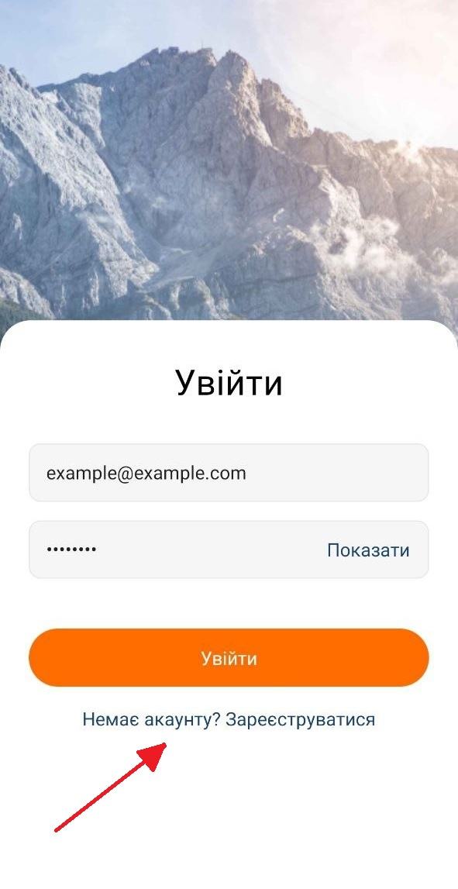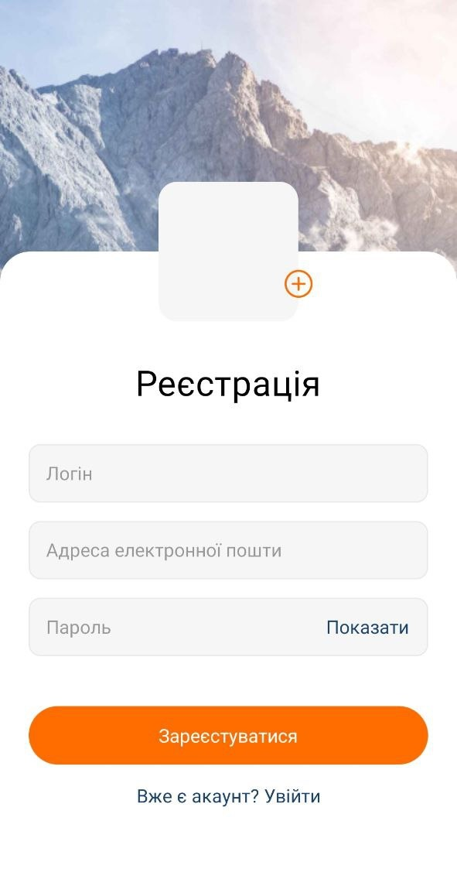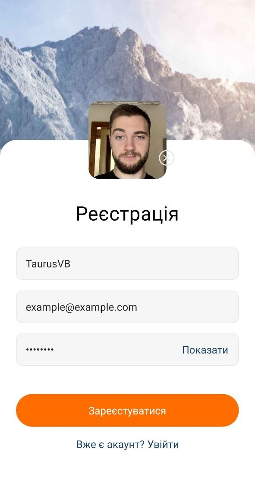

- On the registration screen, new users can create an account.
- Users need to enter their email, password, login, and choose a profile photo from the gallery.

###### Additionally, there is a feature that, if you logged in previously, you won't need to enter your credentials again. The app will directly take you to the 'Publications' screen.

---

## Publications

After a successful login or registration, you will be redirected to the 'Publications' screen. Here, you can explore registered users and view their photo posts.

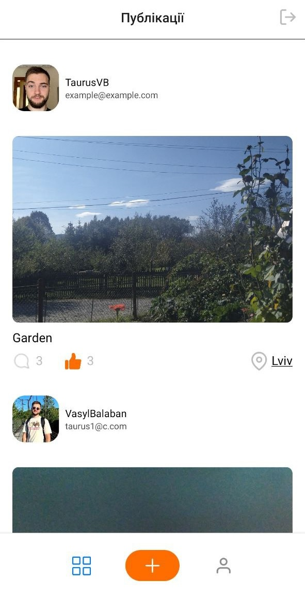

On this screen, you can also click the 'Comments' button to access the comments page, where you can leave comments on other users' posts and reply to comments left on your posts.

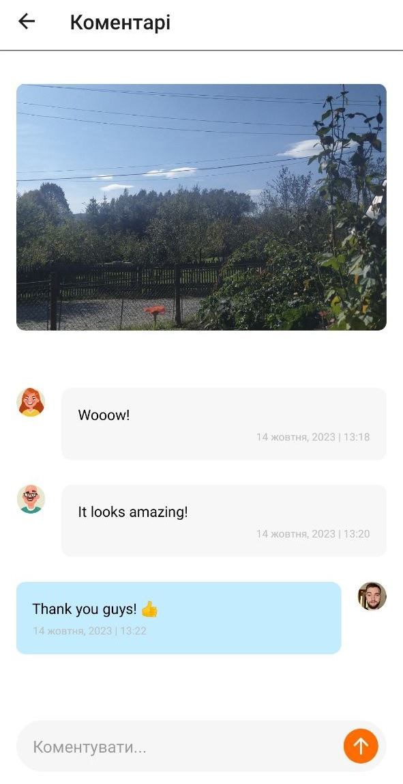

The 'Publications' screen includes a 'Like' feature. You can like posts from other users.

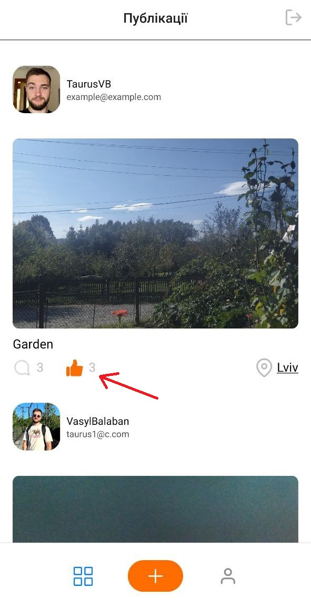

The most exciting feature is the 'Location' button. When you tap it, you will be taken to a map showing the location where the photo of a specific post was taken.

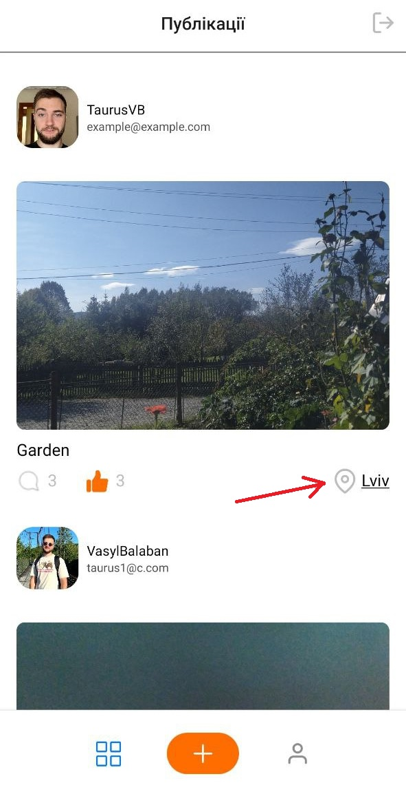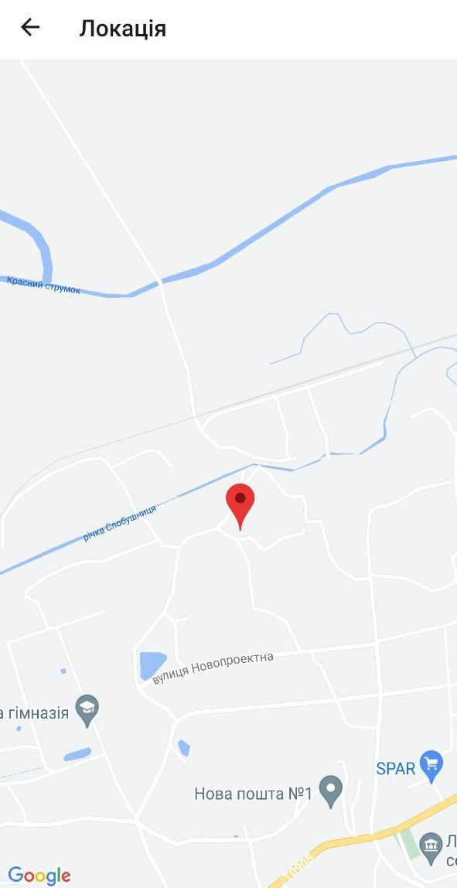

---

## Creating a Post

After tapping the 'Create Post' button on the 'Publications' screen, you'll be directed to the 'Create Post' screen.

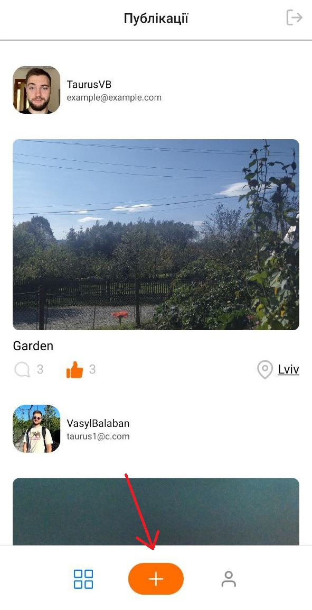

On this screen, the camera will open automatically, allowing you to take a photo.

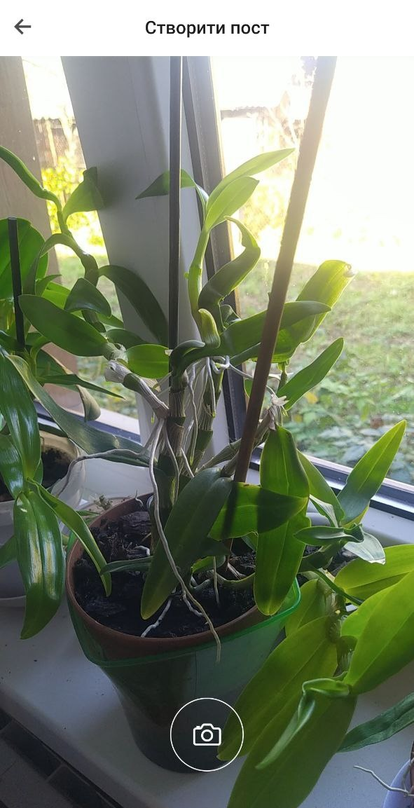

Once you've successfully captured a photo, you can provide details for your post. These details include a post title and the location where the photo was taken.

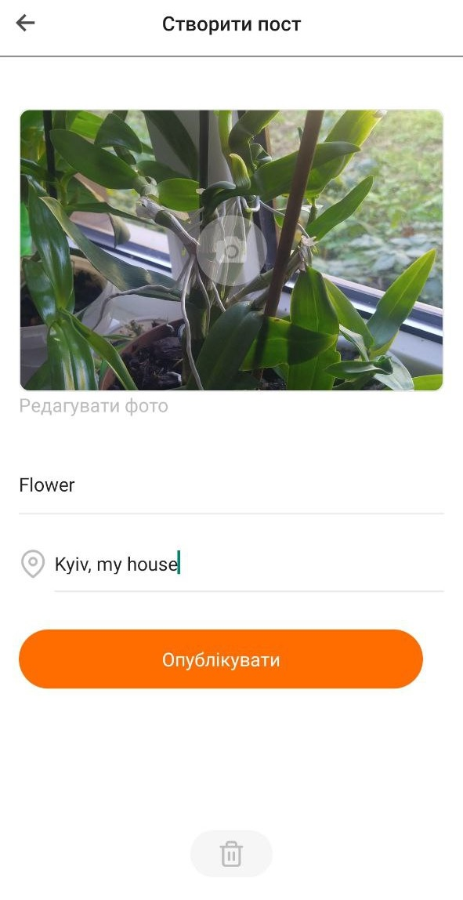

If you're not satisfied with the photo, you can replace it.

After filling in the post details, you can click the 'Publish' button. This will return you to the 'Publications' screen, where you'll see the post you've just created.

---

## Your Profile

Welcome to your profile screen, where you'll find information about your account, including your posts, username, and profile picture.

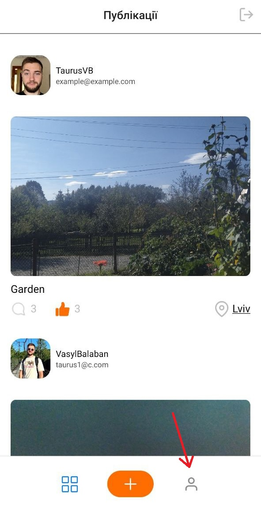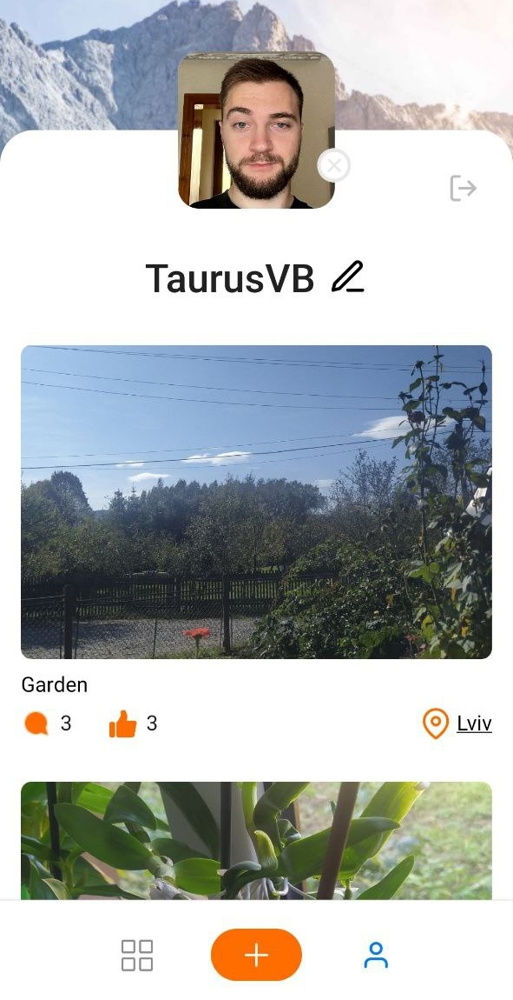

On this screen, you can:

- View all the posts you've created.
- Change your username (nickame).

  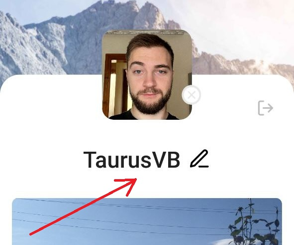

- Update your profile picture.

  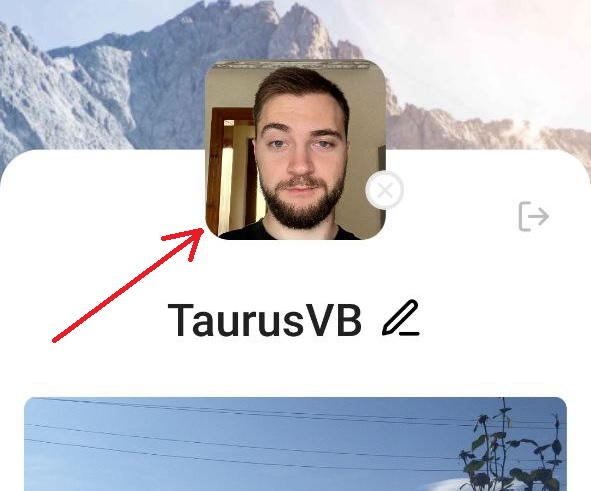

- Log out of your account using the logout button.

  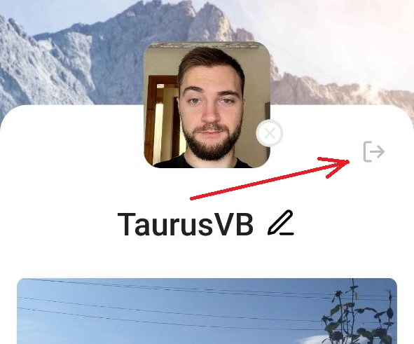

---

## Acknowledgments

PhotoMap has been a labor of love and a significant learning journey. The path of development is ongoing, and there are many exciting features and improvements on the horizon. While this app is far from finished, I wanted to take a moment to express my gratitude to those who have supported me throughout this journey.

Thank you to everyone who has encouraged me, provided feedback, and believed in the potential of PhotoMap. Your support fuels my motivation to continue making PhotoMap even better.

There's a lot more to come, and I'm excited to shape the future of PhotoMap with your continued support.

Stay tuned, and thank you for being part of this journey! 😊
